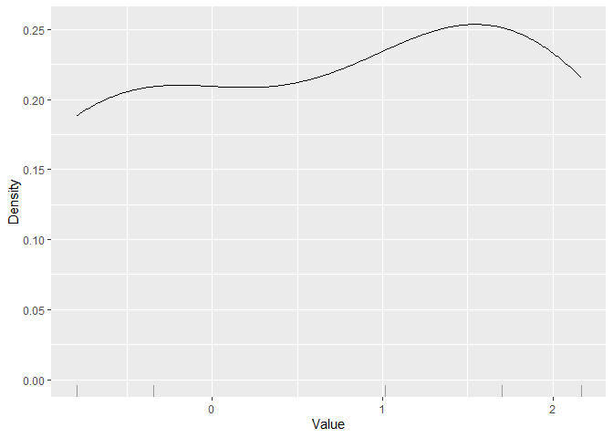
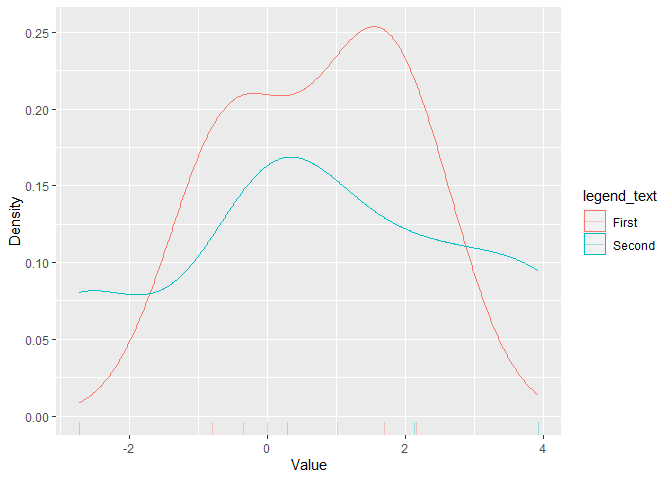
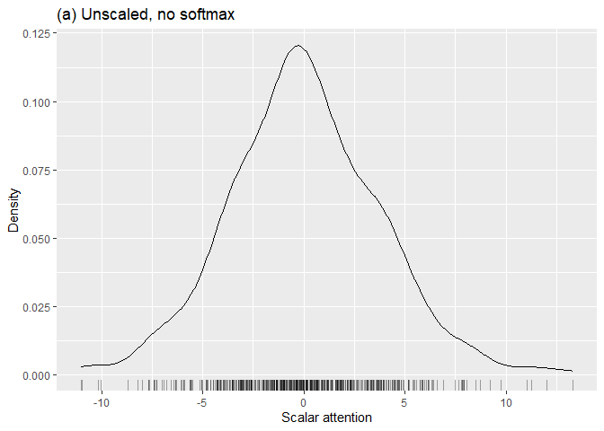

# attnsims

# An R package for simulating attention

The `attnsims` R package was written by James Bernhard to produce
simulations and plots for his paper [“Alternatives to the Scaled Dot
Product for Attention in the Transformer Neural Network
Architecture”](https://arxiv.org/abs/2311.09406).

## The main functions

The two main functions in this package are `simulate_attentions` and
`plot_attentions`. The man pages for those functions explain their use
in full, but we will give some examples of how they are used here. (The
package also defines functions `observe_random_vector` and
`scaled_softmax`, both of which might be helpful in conjunction with the
main two functions.)

The function `simulate_attentions` simulates keys and queries whose
components are independent, and whose components can be sampled by the
function of `n` that is specified in the `distribution_sampler` argument
(which defaults to `rnorm`). The simulated keys and queries have
dimension given by the `key_dimension` argument, and the `n_keys` and
`n_queries` arguments specify how many keys and queries to simulate. A
scalar attention function can be specified using the
`scalar_attention_function` argument, which defaults to the dot product.
Also, a rescaling function (applied after the attentions of each query
are computed for all keys) can be specified with the
`rescaling_function` argument. See the man page for the details on this
function.

``` r
#|echo: false
suppressWarnings(library(attnsims))
```

For example, to simulate independent standard normally distributed
components for 5 queries and 3, both of dimension 8, you can use:

``` r
set.seed(100)
simulate_attentions(distribution_sampler = rnorm, n_queries=5, n_keys=3, key_dimension=8)
```

               [,1]       [,2]      [,3]
    [1,] -0.3469203 -3.3610531  5.836371
    [2,] -0.7969010 -0.3793255 -2.135525
    [3,]  1.0148900 -0.8466812 -5.544451
    [4,]  2.1651682  1.1279306 -2.197663
    [5,]  1.7030236 -0.3800113  0.291965

The `plot_attentions` function makes a kernel density estimate plot of
(by default) the first column of the output from `simulate_attentions`.
To plot another column, specify the column number in the `key_index`
argument. For example,

``` r
set.seed(100)
plot_attentions(attention_matrices=simulate_attentions(distribution_sampler = rnorm, n_queries=5, n_keys=3, key_dimension=8))
```



To plot more than one set of simulated attentions simultaneously, you
can specify a list of matrices for the `attention_matrices` argument,
rather than just a single matrix. To specify how these matrices are
referred to in the plot’s legend, you can provide a vector or list of
strings in the `legend_texts` argument. For example:

``` r
set.seed(100)
matrix1 <- simulate_attentions(distribution_sampler = rnorm, n_queries=5, n_keys=3, key_dimension=8)
matrix2 <- simulate_attentions(distribution_sampler = rnorm, n_queries=5, n_keys=3, key_dimension=8)
plot_attentions(attention_matrices=list(matrix1, matrix2), legend_texts=list("First", "Second"))
```



## The figures in the paper

To produce the figures in the paper, first we loaded the `attnsims` and
`ggplot2` packages:

``` r
library(ggplot2)
```

    Warning: package 'ggplot2' was built under R version 4.3.2

``` r
library(attnsims)
```

Then it was useful to define some auxiliary functions that are referred
to in the paper:

``` r
sqrt_dimension_rescale <- function(keys, x)
  attnsims::scaled_softmax(x=x, divide_by=sqrt(ncol(keys)))

total_length_rescale <- function(keys, x)
  attnsims::scaled_softmax(x=x, divide_by=sum(apply(keys, 1, \(x) norm(x, type = "2"))))
```

The `scaled_softmax` function is defined so that it first divides a
vector by `divide_by` and then applies softmax.

For the paper, it was useful to set up some variables governing how the
simulations would be done:

``` r
key_dimension <- 256
softmax_plots_key_dimension <- 16
n_keys <- 32
n_queries <- 500 # was 100
random_seed <- 1000
```

The plots were then produced as follows:

``` r
set.seed(random_seed)
attention_matrices <- attnsims::simulate_attentions(distribution_sampler = rnorm, n_keys=n_keys, n_queries = n_queries, key_dimension = softmax_plots_key_dimension, rescaling_function = \(x, keys) x)
no_softmax_plot <- attnsims::plot_attentions(attention_matrices=attention_matrices, key_index=1) +
  ggtitle("(a) Unscaled, no softmax") + xlab("Scalar attention")

attention_matrices <- attnsims::simulate_attentions(distribution_sampler = rnorm, n_keys=n_keys, n_queries = n_queries, key_dimension = softmax_plots_key_dimension, rescaling_function = \(x, keys) attnsims::scaled_softmax(x, divide_by=1))
unscaled_softmax_plot <- attnsims::plot_attentions(attention_matrices=attention_matrices, key_index=1) +
  ggtitle("(b) Unscaled, softmax only") + xlab("Rescaled vector attention component")

attention_matrices <- attnsims::simulate_attentions(distribution_sampler = rnorm, n_keys=n_keys, n_queries = n_queries, key_dimension = softmax_plots_key_dimension, rescaling_function = sqrt_dimension_rescale)
scaled_softmax_plot <- attnsims::plot_attentions(attention_matrices=attention_matrices, key_index=1) +
  ggtitle("(c) Scaled, softmax") + xlab("Rescaled vector attention component")


attention_matrices <- attnsims::simulate_attentions(distribution_sampler = rnorm, n_keys=n_keys, n_queries = n_queries, key_dimension = key_dimension, rescaling_function = \(x, keys) x)
before_rescaling_plot <- attnsims::plot_attentions(attention_matrices=attention_matrices, key_index=1) +
  ggtitle("(a) Dot product, not rescaled") + xlab("Scalar attention")

attention_matrices <- attnsims::simulate_attentions(distribution_sampler = rnorm, n_keys=n_keys, n_queries = n_queries, key_dimension = key_dimension, rescaling_function = sqrt_dimension_rescale)
sqrt_d_plot <- attnsims::plot_attentions(attention_matrices=attention_matrices, key_index=1) +
  ggtitle("(b) Divided by square root of key dimension, softmax applied") + xlab("Rescaled vector attention component")

attention_matrices <- attnsims::simulate_attentions(distribution_sampler = rnorm, n_keys=n_keys, n_queries = n_queries, key_dimension = key_dimension, rescaling_function = total_length_rescale)
total_key_length_plot <- attnsims::plot_attentions(attention_matrices=attention_matrices, key_index=1) +
  ggtitle("(c) Divided by sum of key lengths, softmax applied") + xlab("Rescaled vector attention component")
```

The first three plots were in Figure 1 and the next three in Figure 2 in
the paper. For example:

``` r
print(no_softmax_plot)
```



Other simulations with different distributions can similarly be
generated and plotted.
